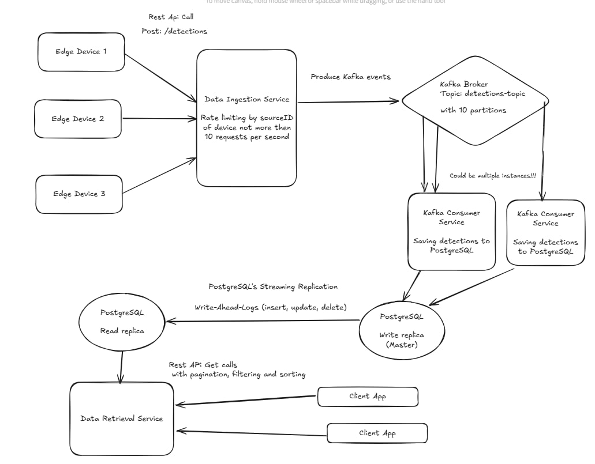

# Real-Time Object Recognition Data Pipeline Overview

This project implements a real-time object recognition data pipeline that processes detection data from edge devices, stores it in a database, and provides an API for querying the data. The system is designed to handle high throughput, ensure data consistency, and provide efficient data retrieval.




## Architecture Components

Edge Devices: Continuously perform object recognition and send detection data to the backend.

Data Ingestion Service: Receives detection data from edge devices, applies rate limiting, and produces Kafka events.

Kafka Broker: Acts as a message broker to decouple data ingestion from processing.

Kafka Consumer Service: Consumes detection data from Kafka and saves it to PostgreSQL.

PostgreSQL: Stores detection data with streaming replication for high availability.

Data Retrieval Service: Provides a REST API for querying detection data with pagination, filtering, and sorting.

Client App: Retrieves and displays detection data.
## Data Flow

Edge Devices send detection data to the Data Ingestion Service.

The Data Ingestion Service applies rate limiting (10 requests per second per device) and produces Kafka events to the detections-topic.

The Kafka Broker distributes the events across 10 partitions.

The Kafka Consumer Service consumes the events and saves the detection data to PostgreSQL.

PostgreSQL uses streaming replication to maintain a read replica for high availability.

The Data Retrieval Service provides a REST API for querying detection data.

The Client App interacts with the Data Retrieval Service to retrieve and display data.
## Data Ingestion API

```http
  POST /detections
```

Request:
```jsx
{
  "source": "device-123",
  "detections": [
    {
      "timestamp": "2023-10-01T12:34:56Z",
      "uniqueId": "obj-456",
      "geoLocation": {
        "latitude": 37.7749,
        "longitude": -122.4194
      },
      "type": "person",
      "confidence": 0.95
    }
  ]
}
```

Response:
```jsx
200 OK: Detections received and being processed.
```
```jsx
429 Too Many Requests: Rate limit exceeded.
```


## Data Retrieval API

```http
  GET /detections
```

Query Parameters:

source: Filter by device ID.

type: Filter by object type.

startTime: Start timestamp for filtering.

endTime: End timestamp for filtering.

page: Page number for pagination.

size: Number of results per page.

Response:
```jsx
{
  "data": [
    {
      "timestamp": "2023-10-01T12:34:56Z",
      "source": "device-123",
      "uniqueId": "obj-456",
      "geoLocation": {
        "latitude": 37.7749,
        "longitude": -122.4194
      },
      "type": "person",
      "confidence": 0.95
    }
  ],
  "page": 1,
  "size": 10,
  "total": 1000
}
```
## Data Base Structure

```sql
CREATE TABLE detections (
    id SERIAL PRIMARY KEY,
    timestamp TIMESTAMP NOT NULL,
    source VARCHAR(50) NOT NULL,
    unique_id VARCHAR(50) NOT NULL,
    latitude DOUBLE PRECISION NOT NULL,
    longitude DOUBLE PRECISION NOT NULL,
    type VARCHAR(50) NOT NULL,
    confidence DOUBLE PRECISION NOT NULL
);
```

#### Indexes for Read replica:

```sql
CREATE INDEX idx_timestamp ON detections (timestamp);
CREATE INDEX idx_source ON detections (source);
CREATE INDEX idx_type ON detections (type);
```
